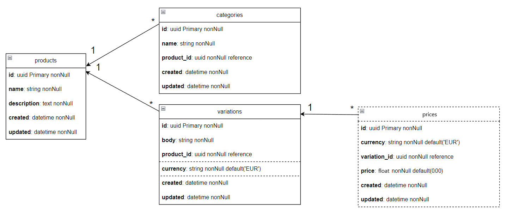

# Exove 2023 developer test

## Contents
- [Tasks](#tasks)
  - [1A Sorting Algorithm](#1a-sorting-algorithm)
  - [2B Create an SQL query](#2b-create-an-sql-query)
  - [3A Get data and save it locally](#3a-get-data-and-save-it-locally)
- [Installation And Testing](#installation-and-testing)
- [Postinstall Script README](#postinstall-script-readme)
- [Environment File Structure](#environment-file-structure)

## Tasks:
### 1A Sorting Algorithm
In this project, I have implemented a sorting algorithm that sorts strings based on the ASCII code of the third letter first, then the second letter, and finally the first letter. I have provided two different solutions for this task:

1. **asciiSort**: A function that utilizes JavaScript's built-in sort function to achieve the desired sorting order.

2. **asciiSortFromScratch**: A custom sorting function that was written from scratch, using only basic logic and no built-in sorting functions. This algorithm was developed in a way so it would make an array shorter with each pass, which makes it optimal and faster with each pass.

The reason behind providing two solutions is that the task requirements were not entirely clear, and I wanted to ensure that both possibilities were covered. In case the task required a custom sorting algorithm without using any built-in methods, I have provided the `asciiSortFromScratch` function as a solution.

I have tested both implementations thoroughly with different test cases, including cases with words having the same third and second characters, and cases with words having the same third character. The test results confirm that both implementations are working correctly and provide the expected sorting order.

Please refer to the code and test files for a detailed understanding of the algorithms and their respective test cases.
### 2B Create an SQL query
In this task, I have implemented an SQL query to combine information from two tables, people and phones. The provided tables indicate that a MySQL database is being used, which is why I have been using MySQL.

The goal was to create a single query that produces the full name of each person, along with their associated phone numbers in a single column, separated by commas. If a person does not have any phone numbers, the result should display `'N/A'` for that person.

Here is the query I have developed for this task:
```
SELECT CONCAT(first_name, ' ', last_name) AS name,
       GROUP_CONCAT(number SEPARATOR ',') AS numbers
FROM people
LEFT JOIN phones ON people.id = phones.user_id
GROUP BY name;
```
The query utilizes the `LEFT JOIN` clause to combine the people and phones tables, connecting them through the user_id column in the phones table and the id column in the people table. This approach ensures that every person is included in the result, even if they do not have any phone numbers.

The `CONCAT` function is used to create the full name by concatenating the `first_name` and `last_name` columns. The `GROUP_CONCAT` function is used to merge multiple phone numbers associated with the same person into a single column, separated by commas.

By using the `GROUP BY` clause, we ensure that each person appears only once in the result, with their phone numbers combined into the numbers column.

Please refer to the provided code for a complete understanding of the query and its structure.
### 3A Get data and save it locally
In this task, I have implemented a solution that fetches product data from a remote API and saves it into a local MySQL database. As MySQL was utilized in the task from section 2, I employed it for this task as well. This enables me to utilize a single docker image to test both tasks. The code is organized into different files for better readability and to facilitate potential changes to the logic.

The data contains hierarchical information and schemaless data. To handle this, I have created separate tables in the database for **products**, **categories**, and **variations**. The schemaless data for variations is saved in the form of JSON. In cases where objects do not have IDs, I generate UUIDs before saving the data.



I have added support for extra `currencies` by adding a currency column for the `variations` table. This allows users to specify the currency they are posting the price in. If multiple currencies need to be added to a single variation of the product, this can be achieved by creating a new table with prices and linking each price to the corresponding variation using a foreign key.

To update the product data from the API without re-saving everything, I have implemented an update and insert logic in a single function. This ensures that only the parts of the data that have changed are saved or updated.

The following tests have been performed on the solution:

1. Fetch product info from the URL.
2. Save product info to the database.
3. Update product info in the database using the same function as saving.

The provided code offers a complete understanding of the solution and its structure. For more details, please refer to the code.

## Installation And Testing
1. Ensure that **Node.js (version 16.x.x or higher)** is installed on your computer.
2. Verify that you have access to a running **MySQL database** or that **Docker** is installed.
3. Generate a **.env** file in the project's root directory (the structure of the env file is detailed further in this document).
4. Execute **`npm i`** in the project root directory and follow given prompts.
5. To test the tasks, enter **`npm run test`**.

## Postinstall Script README
This postinstall script is designed to simplify the setup process for my application by automating the installation and configuration of a MySQL database within a Docker container. The script serves the following purposes:

1. **Check for Docker installation**: The script first checks if Docker is installed on your system. If not, it displays a message indicating that Docker is not installed.

2. **Ask for user consent**: If Docker is installed, the script prompts you to confirm whether you want to install the Docker image containing a MySQL database.

3. **Install and configure the MySQL Docker container**: If you choose to proceed with the installation, the script will: 
    - Check if a Docker container with the specified name already exists.
    - If it doesn't exist, it prompts you to enter the database root password.
    - Creates a new Docker container with the specified name, exposing the MySQL default port (3306) and sets the root password and initial database name.
4. **Display status messages**: Throughout the script execution, you'll receive messages updating you on the current status, such as whether the container was created successfully, and if the test database was created. You can modify the database name through the environment file. Please refer to the main README for more information.

5. **Cancel the installation**: If you choose not to install the Docker image, the script displays a cancellation message and exits gracefully.

This script is a convenient way to set up the necessary environment for running and testing the application without manual intervention.

## .env File Structure
This project requires a **.env** file to be placed in the root directory. The file should contain the following environment variables:

- **PRODUCTS_URL**: The URL where the products JSON file is hosted. By default, it is set to `https://raw.githubusercontent.com/Exove/developer-test/main/material/products.json`.
- **DB_HOST**: The IP address or hostname of your MySQL database server. For a local installation, use `127.0.0.1`.
- **DB_USER**: The username for your MySQL database. The default user is `root`.
- **DB_PASSWORD**: The password associated with the MySQL database user.
- **DB_DB**: The name of the MySQL database to be used by the application. The default database name is `test_database`.
- **DB_PORT**: The port number on which your MySQL database server is listening. The default MySQL port is `3306`.

